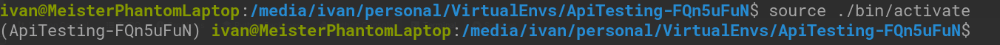

# Project for API's automation

### 1 - Create o replicate virtual environment


From console terminal

1 - Install pipenv library

**Note:** Validate if you have pip library install in your computer

```
pip install pipenv
```

2 - Clone or download the repository

3 - From root folder project
```
pipenv install
```
```
pipenv shell
```
**_This command recreate the virtual environment, be careful when the environment is created, you should see the path where the virtual environment was created_**

4 - For initiate the virtual environment.

```
source ./path/virtual/environment/bin/activate
```
note that the name of the virtual environment appears at the beginning of the command line. This indicates that you are already working with the virtual environment 


### 3 - Run Tests ###

1 - For execute the test, execute the follow command
```
python -m pytest -n auto ./bdd/features
```